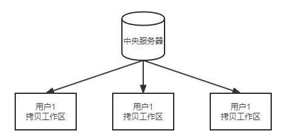
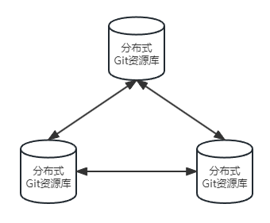

 ## Git 简介

 ### Git 是什么？

 - Git 是一个开源的分布式版本控制系统，用于敏捷高效地处理任何或小或大的项目。
 - Git 是 Linus Torvalds 为了帮助管理 Linux 内核开发而开发的一个开放源码的版本控制软件。
 - Git 与常用的版本控制工具 CVS, Subversion 等不同，Git 是分布式版本控制系统，不必服务器端软件支持。

 ### 集中式 vs 分布式

 #### 集中式
 - 在集中式版本控制系统中，代码库存储在中央服务器上，开发人员需要从该服务器中获取最新的代码，并在本地进行修改。开发人员提交的更改需要上传到服务器才能与其他人共享。这种情况下，如果服务器出现故障或网络中断，开发人员将无法执行版本控制操作。
 - 集中式版本控制系统的主要缺点在于其依赖于网络连接才能正常工作。尤其是在互联网环境下，当遇到网络速度较慢的情况时，开发人员提交较大文件的操作可能会变得异常缓慢。举例来说，即使是一个大小为10M的文件，在面临网络速度缓慢的情况下，提交所需的时间可能长达5分钟，这种情况可能会给开发人员带来不便和压力。
 - 在集中式版本控制系统中，分支和合并操作较为复杂，需要通过服务器进行协调。
 ::: center
 
 :::

 #### 分布式
 - 分布式版本控制系统会将完整的代码仓库克隆到每个开发人员的本地机器上。每个开发人员都拥有完整的历史记录和版本库，可以在本地进行修改和提交，而无需依赖中央服务器。
 - 开发人员可以在没有网络连接的情况下继续工作，并且可以在完成开发后将更改推送到远程存储库进行共享。这种分布式的特性使得团队成员可以并行工作，而不会互相干扰。
 - 分支和合并更加简单和快速，因为每个开发人员都有自己的本地分支，可以自由地进行合并操作。
 ::: center
 
 :::


 ## Git 的安装及配置

 ### Git 的安装

 #### Linux(以 CentOS 为例)

 1. 安装所需软件包
 ```
 yum install curl-devel expat-devel gettext-devel openssl-devel zlib-devel
 yum install gcc perl-ExtUtils-MakeMaker
  ```
 2. 下载 & 安装
 ```
 # 进入安装目录
 cd /安装目录

 # 执行下载命令
 wget https://www.kernel.org/pub/software/scm/git/git-2.15.1.tar.gz

 # 解压
 tar -zxzf git-2.15.1.tar.gz -C /安装目录

 # 进入解压目录
 cd /安装目录/git-2.15.1

 # 编译 /usr/local/git为编译安装目录
 make prefix=/usr/local/git all 

 # 安装
 make prefix=/usr/local/git install
 ```
 #### macOS
 ::: tip
 macOS 系统下，推荐使用 HomeBrew 进行安装
 ::: 

 1. 通过 brew 查看可安装的 Git 程序包

 ``` :no-line-numbers 
 brew search git
 ```

 2. 安装 Git

 ``` :no-line-numbers 
 brew install git
 ```

 #### Windows

 1. 进入 [Git 官网下载](https://git-scm.com/download/win)
 2. 运行下载好的exe文件
 3. 选择安装位置
 4. 使用默认配置完成安装
 
 ### Git 的配置

 #### 设置用户名和邮箱

 ::: tip
 由于 Git 是分布式版本控制系统，远程仓库需要根据用户名和邮箱跟踪提交者的身份。通过设置用户名和密码可以在提交代码时方便地查看代码贡献者的身份，这有助于提高代码质量和代码管理的可读性。在开源项目中，通过提交者的用户名，我们可以更好地跟踪和管理代码库。
 :::

 ```
 git config --global user.name "用户名"
 git config --global user.email "电子邮箱地址"
 ```

 此外，还可以在项目中的 .git 文件中找到 config 文件修改用户名和邮箱。注意，此时设置用户名和邮箱只在该项目中生效，不是全局生效。

 #### 配置密钥

 ::: tip
 当使用 Git 时，配置密钥是为了确保你的身份可以被验证和授权，以便进行安全的代码交互和版本控制。想象一下，你想在 GitHub 上上传你的代码并与团队成员协作，但在每次操作时都需要输入用户名和密码。这种方式既繁琐又不安全，因为密码可能会被截获或泄漏。
 :::

 1. 生成密钥
 ```
 ssh-keygen -t rsa -C " 电子邮箱地址" 
 ```
 2. 添加公钥到托管服务(以 GitHub 为例)
 - 复制生成的密钥

 ::: tip
 在不同的操作系统上，生成的公钥位置会有所不同。
 - Linux: 生成的公钥一般位于 ~/.ssh/id_rsa.pub
 - macOS: 生成的公钥一般位于 /Users/YourUsername/.ssh/id_rsa.pub
 - Windows: 生成的公钥一般位于 C:\Users\YourUsername\.ssh\id_rsa.pub
 :::

 - 登录 GitHub 账户后，点击右上角的头像，选择"Settings"
 - 在左侧菜单中，选择 "SSH and GPG keys"
 - 点击 "New SSH key"
 - 在 "Title" 字段中，为你的密钥起一个描述性的名称
 - 在 "Key" 字段中，粘贴你之前复制的公钥内容
 - 点击 "Add SSH key" 按钮

 ## Git 的工作区、暂存区和版本库

 ### 工作区


 ### 暂存区

 
 
 ### 版本库

 ## Git 基础操作

 ### 初始化仓库

 在开始使用 Git 之前，需要对本地项目进行初始化，以便将其转换为 Git 可识别的仓库。这个仓库里面的所有文件都可以被 Git 管理起来，每个文件的修改、删除，Git 都能跟踪，以便任何时刻都可以追踪历史，或者在将来某个时刻可以“还原”。初始化仓库非常简单，只需在项目的根目录下执行以下命令:

 ```:no-line-numbers
 git init
 ```

 此命令会在当前目录下创建一个名为 .git 的隐藏文件夹，用户存储 Git 相关的数据和配置信息。这个隐藏文件夹包含了项目中的所有版本控制信息，不需要直接操作这个目录，Git 会自动处理。

 也可以在一个空目录下初始化 Git 仓库。这是从零开始创建一个项目的好方法。首先，需要创建一个新的空目录，然后进入该目录并执行 `git init` 命令:

 ```:no-line-numbers
 mkdir new_project
 cd new_project
 git init
 ```

 在初始化仓库后，可以通过以下命令查看项目的状态:

 ```:no-line-numbers
 git init
 ```

 此时，可能会看到项目中的文件处于未跟踪 (Untracked) 状态，表示这些文件尚未添加到 Git 的版本控制中。后续将了解如何将文件添加到版本控制。

 现在，已经成功初始化了 Git 仓库并做好了相应配置，可以开始使用 Git 进行版本控制了。

 ### 添加文件到暂存区

 ### 提交更改到本地仓库

 ### 查看仓库状态

 ### 查看提交历史

 ### 撤销更改

 ### 删除文件

 ## Git 分支管理

 ### 创建分支

 ### 切换分支
 
 ### 合并分支

 ### 删除分支

 ### 解决分支冲突

 ## 远程仓库

 ### 什么是远程仓库？

 ### 添加远程仓库

 ### 克隆远程仓库

 ### 推送本地仓库到远程

 ### 从远程仓库拉取更新

 ### 远程仓库分支管理

 ## Git 标签


# Git 学习笔记大纲

## 1. Git 简介
- 1.1 Git 的起源与发展
- 1.2 版本控制系统的类型
- 1.3 Git 的特点与优势

## 2. Git 安装与配置
- 2.1 安装 Git
- 2.2 配置 Git

## 3. Git 基础操作
- 3.1 初始化仓库
    - `git init`
- 3.2 添加文件到暂存区
    - `git add`
- 3.3 提交更改到本地仓库
    - `git commit`
- 3.4 查看仓库状态
    - `git status`
- 3.5 查看提交历史
    - `git log`
- 3.6 撤销更改
    - `git checkout`
    - `git reset`
- 3.7 删除文件
    - `git rm`

## 4. Git 分支管理
- 4.1 创建分支
    - `git branch`
- 4.2 切换分支
    - `git checkout`
- 4.3 合并分支
    - `git merge`
- 4.4 删除分支
    - `git branch -d`
- 4.5 分支冲突解决

## 5. 远程仓库
- 5.1 什么是远程仓库
- 5.2 添加远程仓库
    - `git remote add`
- 5.3 克隆远程仓库
    - `git clone`
- 5.4 推送本地仓库到远程
    - `git push`
- 5.5 从远程仓库拉取更新
    - `git pull`
- 5.6 远程仓库分支管理

## 6. Git 工作流
- 6.1 Git 工作流类型
    - 集中式工作流
    - 功能分支工作流
    - Gitflow 工作流
    - 分叉式工作流
- 6.2 选择合适的工作流

## 7. Git 实用技巧
- 7.1 使用 `.gitignore` 忽略指定文件
- 7.2 使用别名简化命令
- 7.3 使用 `git stash` 暂存当前工作
- 7.4 使用 `git cherry-pick` 拣选提交
- 7.5 使用 `git rebase` 变基

## 8. 参考资料与学习资源
- 8.1 官方文档
- 8.2 教程与书籍
- 8.3 在线学习平台
- 8.4 社区与论坛
