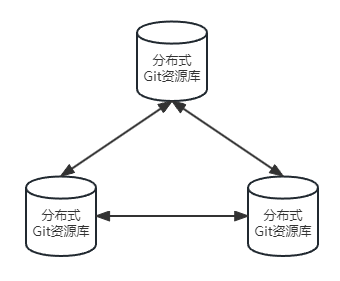

# Git的原理及使用

 ## Git简介-

 ### Git是什么？
 - Git 是一个开源的分布式版本控制系统，用于敏捷高效地处理任何或小或大的项目。
 - Git 是 Linus Torvalds 为了帮助管理 Linux 内核开发而开发的一个开放源码的版本控制软件。
 - Git 与常用的版本控制工具 CVS, Subversion 等不同，Git是分布式版本控制系统，不必服务器端软件支持。

 ### 集中式vs分布式
 #### 集中式
 - 在集中式版本控制系统中，代码库存储在中央服务器上，开发人员需要从该服务器中获取最新的代码，并在本地进行修改。开发人员提交的更改需要上传到服务器才能与其他人共享。这种情况下，如果服务器出现故障或网络中断，开发人员将无法执行版本控制操作。
 - 集中式版本控制系统的主要缺点在于其依赖于网络连接才能正常工作。尤其是在互联网环境下，当遇到网络速度较慢的情况时，开发人员提交较大文件的操作可能会变得异常缓慢。举例来说，即使是一个大小为10M的文件，在面临网络速度缓慢的情况下，提交所需的时间可能长达5分钟，这种情况可能会给开发人员带来不便和压力。
 - 在集中式版本控制系统中，分支和合并操作较为复杂，需要通过服务器进行协调。
::: center

:::

 #### 分布式
 - 分布式版本控制系统会将完整的代码仓库克隆到每个开发人员的本地机器上。每个开发人员都拥有完整的历史记录和版本库，可以在本地进行修改和提交，而无需依赖中央服务器。
 - 开发人员可以在没有网络连接的情况下继续工作，并且可以在完成开发后将更改推送到远程存储库进行共享。这种分布式的特性使得团队成员可以并行工作，而不会互相干扰。
 - 分支和合并更加简单和快速，因为每个开发人员都有自己的本地分支，可以自由地进行合并操作。
::: center

:::
